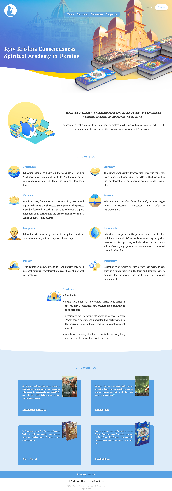

# Krishna Consciousness Academy WordPress Theme

A modern, responsive **WordPress theme** designed for the Krishna Consciousness Academy project.

## Features

- Clean and elegant design with a focus on readability
- Responsive layout for desktop, tablet, and mobile devices
- Ready-to-use demo content
- Multilingual support

## Demo Access

🌐 [Live Demo](https://silly-penni-pasechnik-856c351d.koyeb.app/)

You can explore the demo website in two ways:

- **Administrator access**  
  Login: `admin`  
  Password: `admin`

- **Register as a user**  
  Simply create your own account and test the theme as a regular user.

## License

This theme is distributed under the
[GPLv2 License](https://www.gnu.org/licenses/old-licenses/gpl-2.0.en.html).
